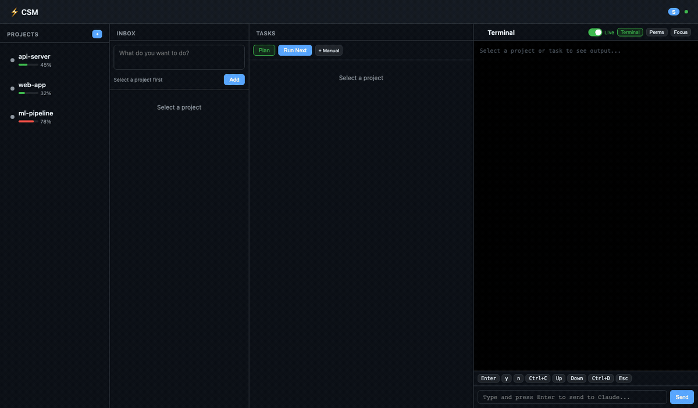

# CSM — Claude Session Manager

A single control center for all your Claude Code sessions. Monitoring, tasks, pipeline — everything in one web dashboard.


> **[Русская версия](README.md)**

---

## Demo



---

## What is this and why

You're working with Claude Code on multiple projects at once. Each project is a separate tmux session. You switch between them, lose context, forget that Claude has been waiting for your input for 10 minutes somewhere.

**CSM solves this problem.** One web dashboard shows all sessions at a glance: who's working, who needs input, where there's an error, how many tokens are spent. You can send input directly from the browser without switching tmux.

But CSM is more than just a monitor. It's a **work management system**:

- Write ideas and wishes to each project's Inbox
- AI converts them into concrete tasks
- Tasks execute one by one, each in its own Claude session
- You watch the progress from the dashboard

---

## How it works

### Projects = contexts

Each project in CSM is a code directory linked to a tmux session. CSM doesn't know about your code directly — it watches the tmux pane where Claude Code runs and detects status by matching patterns in terminal output.

```
Project "bms"  →  tmux session "bms"  →  Claude Code working inside
Project "api"  →  tmux session "api"  →  Claude Code waiting for input
```

### Wishes — your Inbox

A wish is a high-level request. Not a task, not a ticket, but a thought: *"I want login to work through OAuth"*, *"rewrite tests to vitest"*, *"add dark theme"*.

Write wishes when the thought comes — right in the dashboard, in the Inbox column of the selected project. No need to formulate precisely right away. Wishes accumulate until you're ready to process them.

### Tasks — units of work

When wishes pile up, you hit **Plan** — AI analyzes all unprocessed wishes and generates concrete tasks:

- Several related wishes can become one task
- One large wish can split into multiple tasks
- Each task is specific enough for Claude Code to complete in a single session

Tasks get a priority and a description sufficient for autonomous execution.

### Execution — one session per task

Each task runs in a separate Claude Code session. CSM creates a tmux session, starts Claude, sends a prompt with the task description and project context. Two modes:

| Mode | When to use |
|------|-------------|
| **Silent** (background) | Task is simple and unambiguous. Claude works autonomously, you review the result after |
| **Interactive** | Task requires decisions along the way. CSM shows when Claude needs input, you respond from the dashboard |

---

## Best practices

### How to write wishes

**Good** — describe *what you want*, not how to do it:
```
Add PDF report export with charts
Rewrite auth — tokens are stored in localStorage now, need httpOnly cookies
Tests fail on CI but pass locally, investigate
```

**Bad** — too vague or dictating implementation:
```
Improve the project                      # too abstract
Open file auth.js line 47 and replace    # that's not a wish, it's a direct command
```

### Single session vs parallel

| Situation | Approach |
|-----------|----------|
| Related changes in one project | Single session, wishes in sequence |
| Independent projects | Parallel sessions — that's what CSM is for |
| Large refactoring | Single session — Claude needs full context |
| Many small fixes in different places | Parallel sessions with separate tasks |

### Reading statuses

| Status | Meaning | Action |
|--------|---------|--------|
| **Working** | Claude is thinking or writing code | Wait |
| **Needs Input** | Claude asked a question or awaits confirmation | Switch and respond (or respond from dashboard) |
| **Idle** | Session is idle — task finished or Claude awaits a command | Review result, give a new task |
| **Error** | Error, rate limit, connection issue | Check terminal, resolve the problem |
| **Offline** | tmux session not found | Recreate or remove from monitoring |

CSM sends alerts when a session stays in **Needs Input** for over 5 minutes or **Idle** for over 10 minutes.

### Pipeline: wish → plan → execute

```
1. Write wishes to project Inbox
         ↓
2. Hit "Plan" — AI groups wishes into tasks
         ↓
3. Review tasks, adjust priorities
         ↓
4. "Execute" — tasks run one by one
         ↓
5. Review results, add new wishes
```

You don't have to use the full pipeline. You can simply monitor sessions and send input — CSM works as a plain monitor too.

---

## Installation

### Requirements

- **[Claude Code CLI](https://docs.anthropic.com/en/docs/claude-code)** — installed and authenticated (`claude` available in terminal)
- **Node.js** 18+
- **tmux** (installed and running)

### Option 1: macOS / Linux

```bash
git clone https://github.com/LynxEsq/Claude-dashboard-system.git
cd Claude-dashboard-system
bash start.sh
```

The `start.sh` script checks dependencies (Homebrew, Node.js, tmux), installs npm packages, and launches the dashboard at http://localhost:9847.

**Manual installation:**
```bash
cd csm && npm install
node src/index.js web
```

### Option 2: Windows (WSL)

```bash
# Inside WSL (Ubuntu/Debian)
git clone https://github.com/LynxEsq/Claude-dashboard-system.git
cd Claude-dashboard-system/csm
npm install

# Local access only
node src/index.js web

# Or allow access from Windows host browser
node src/index.js web --host 0.0.0.0
```

The "Terminal" button on WSL automatically opens Windows Terminal (or cmd.exe as fallback).

### Option 3: Remote dev station

Run CSM on your server, access the dashboard from any device on the network:

```bash
# On the server
node src/index.js web --host 0.0.0.0

# From your laptop — open in browser:
# http://<server-ip>:9847
```

When accessing remotely, CSM automatically detects that the client connected over the network and switches the "Terminal" button to SSH mode — showing a copyable `ssh -t user@host "tmux attach -t session"` command instead of trying to open a terminal window on the server.

> **Security note**: With `--host 0.0.0.0` the server is accessible from the network without authentication. Use in trusted networks only.

### Global command (optional)

```bash
cd csm && npm link       # makes 'csm' command available in terminal
csm web                  # now you can do this
```

### tmux setup (optional)

Interactive setup wizard for plugins and sessions:

```bash
bash csm/templates/setup.sh
```

---

## CLI commands

```bash
# Monitoring
csm status                           # all session statuses
csm status --watch                   # auto-refresh every 3 seconds
csm web                              # start web dashboard
csm web --host 0.0.0.0              # with network access
csm web --port 3000                  # on a different port

# Session management
csm add <name> <tmux-session>        # add session to monitoring
csm add bms bms-session --dir ~/projects/bms
csm remove <name>                    # remove session
csm list                             # list sessions
csm discover                         # find tmux sessions with Claude

# Interaction
csm send <name> <text>               # send text to session
csm focus <name>                     # switch tmux focus

# Configuration
csm config --show                    # show settings
```

---

## Web Dashboard

4-column layout:

| Column | Content |
|--------|---------|
| **Projects** | Session list with status indicators, token usage bars, planning state |
| **Inbox** | Textarea for wishes, wish list with edit/delete |
| **Tasks** | Task list by status, Plan and Run buttons, execution modes |
| **Terminal** | Live terminal output with ANSI colors, raw key buttons, text input |

### Modals

- **Create Project** — name, path with directory browser, auto-start Claude
- **Project Settings** — tmux session, project path, list of all related tmux sessions (main + tasks) with status and attach buttons
- **Directory Browser** — filesystem navigation, git repo and CLAUDE.md indicators
- **Add Manual Task** — title, description, priority
- **Permissions** — quick presets + custom Claude Code permission input
- **SSH Command** (remote access) — copyable SSH command for connecting

### Cross-platform Terminal button

| Platform | Behavior |
|----------|----------|
| **macOS** | Opens Terminal.app with `tmux attach` |
| **WSL** | Opens Windows Terminal (fallback: cmd.exe) |
| **Linux** | gnome-terminal / konsole / xfce4-terminal / xterm |
| **Remote** | SSH command modal with Copy button |

Platform and locality detection is automatic.

---

## Configuration

Settings are stored in `~/.csm/config.json`:

```json
{
  "port": 9847,
  "host": "localhost",
  "pollInterval": 3000,
  "historyRetention": 30,
  "alerts": {
    "needsInputTimeout": 300,
    "idleTimeout": 600,
    "tokenThreshold": 80
  }
}
```

| Option | Default | Description |
|--------|---------|-------------|
| `port` | `9847` | Web dashboard port |
| `host` | `localhost` | Bind address. `0.0.0.0` for network access |
| `pollInterval` | `3000` | tmux polling interval (ms) |
| `historyRetention` | `30` | Days to keep history |
| `alerts.needsInputTimeout` | `300` | Seconds before "Needs Input" alert |
| `alerts.idleTimeout` | `600` | Seconds before "Idle" alert |
| `alerts.tokenThreshold` | `80` | Token usage % alert threshold |

---

## API

The web server provides a REST API and WebSocket connection.

### REST — core endpoints

| Method | Endpoint | Description |
|--------|----------|-------------|
| `GET` | `/api/sessions` | All sessions and their state |
| `POST` | `/api/sessions/create` | Create new session |
| `POST` | `/api/sessions/:name/send` | Send text to session |
| `POST` | `/api/sessions/:name/keys` | Send raw tmux keys |
| `POST` | `/api/sessions/:name/focus` | Switch tmux focus |
| `POST` | `/api/sessions/:name/terminal` | Open terminal (cross-platform) |
| `GET` | `/api/sessions/:name/tmux-sessions` | All project tmux sessions (main + tasks) |
| `POST` | `/api/sessions/:name/restart` | Restart Claude |
| `POST` | `/api/sessions/:name/destroy` | Full project cleanup |

### REST — pipeline

| Method | Endpoint | Description |
|--------|----------|-------------|
| `GET` | `/api/pipeline/:name/wishes` | List wishes |
| `POST` | `/api/pipeline/:name/wishes` | Create wish |
| `POST` | `/api/pipeline/:name/plan` | Run AI planning |
| `GET` | `/api/pipeline/:name/plan/status` | Planning progress |
| `POST` | `/api/pipeline/:name/apply-plan` | Apply plan |
| `GET` | `/api/pipeline/:name/tasks` | Get tasks |
| `POST` | `/api/pipeline/:name/tasks` | Create task |
| `POST` | `/api/pipeline/:name/execute-interactive` | Execute task interactively |
| `POST` | `/api/pipeline/:name/execute-silent` | Execute task silently |
| `GET` | `/api/pipeline/:name/task-status/:taskId` | Execution status |

### REST — platform & filesystem

| Method | Endpoint | Description |
|--------|----------|-------------|
| `GET` | `/api/platform` | Server OS and terminal type |
| `GET` | `/api/access-info` | Local/remote detection, SSH details |
| `GET` | `/api/fs/list?path=...` | Browse directories |

### REST — other

| Method | Endpoint | Description |
|--------|----------|-------------|
| `GET` | `/api/sessions/:name/permissions` | Claude Code permissions |
| `POST` | `/api/sessions/:name/permissions` | Update permissions |
| `GET` | `/api/history/:name/status` | Status history |
| `GET` | `/api/alerts` | Unacknowledged alerts |
| `GET` | `/api/tmux/sessions` | All tmux sessions (tracked / untracked) |

### WebSocket

```
ws://localhost:9847
```

Message types: `state`, `update`, `statusChange`, `alert`, `taskStarted`, `taskCreated`, `wishAdded`, `planStarted`, `planFinished`, `planApplied`.

---

## Architecture

```
csm/
├── src/
│   ├── index.js              # CLI (commander.js)
│   ├── lib/
│   │   ├── config.js         # Configuration (~/.csm/)
│   │   ├── detector.js       # Status detection via regex
│   │   ├── history.js        # SQLite: logs, tokens, alerts
│   │   ├── monitor.js        # Polling loop, EventEmitter
│   │   ├── pipeline.js       # Wishes → Tasks → Execution
│   │   ├── platform.js       # OS detection: macOS, Linux, WSL
│   │   └── tmux.js           # tmux CLI wrapper
│   └── web/
│       └── server.js         # Express + WebSocket
├── public/                   # SPA dashboard
│   ├── index.html
│   ├── css/                  # Dark theme, CSS Grid
│   └── js/                   # state, api, render, actions, websocket
└── templates/
    ├── setup.sh              # tmux setup wizard
    └── tmux-csm.conf         # Recommended tmux config
```

| Layer | Technology |
|-------|-----------|
| Backend | Node.js, Express |
| Database | SQLite (better-sqlite3, WAL mode) |
| Real-time | WebSocket (ws) |
| Frontend | Vanilla JS, CSS Grid |
| CLI | commander.js, chalk |
| Terminal | tmux (execSync) |
| Platform | macOS, Linux, WSL |

Data is stored in `~/.csm/`: `config.json`, `history.db`, `pipeline.db`, `worktrees/`.

---

## License

[MIT](LICENSE)

---

## Contributing

Contributions welcome. Please open an issue first to discuss proposed changes.
