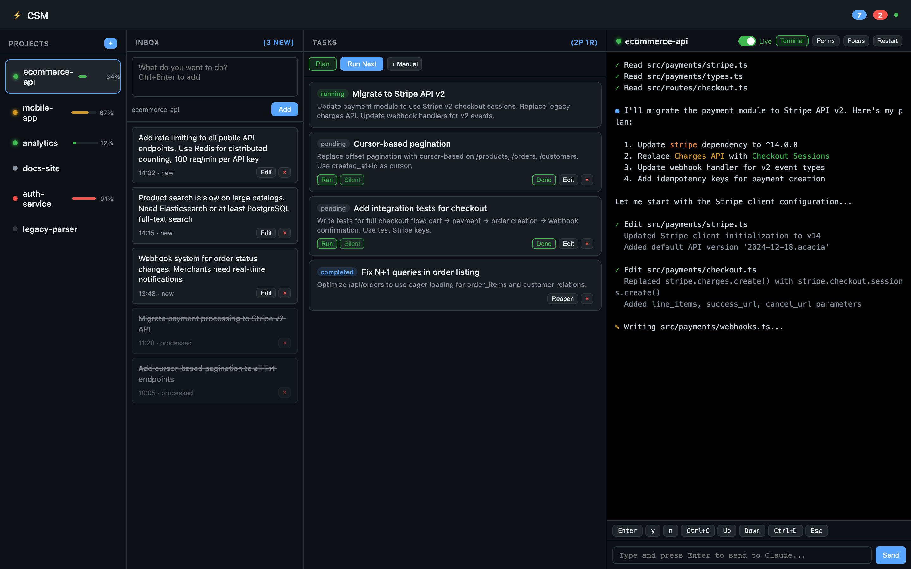
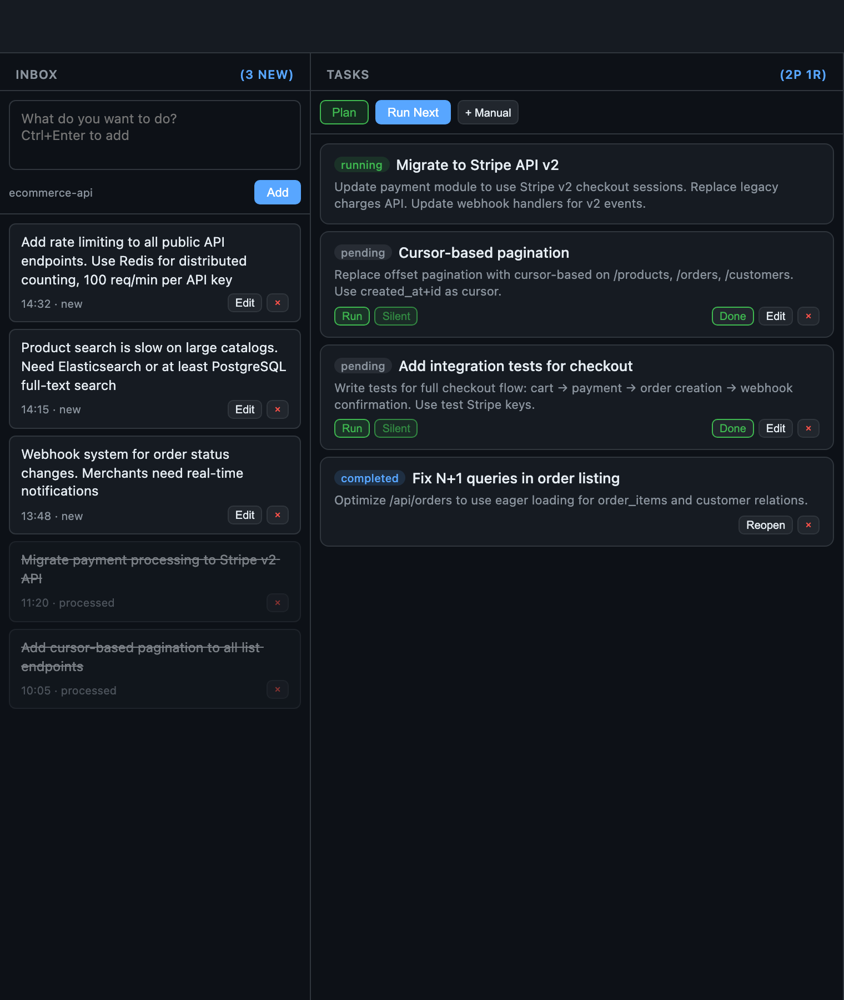
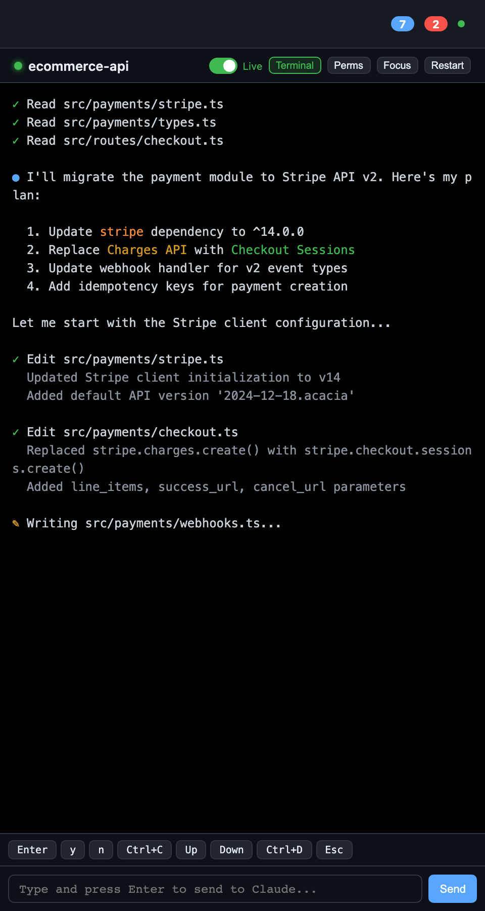
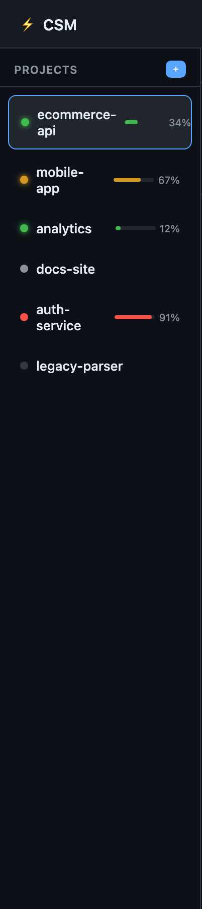

# CSM — Claude Session Manager

Единый центр управления для всех ваших Claude Code сессий. Мониторинг, задачи, pipeline — всё в одном веб-дашборде.


> **[English version](README.en.md)**

---

## Скриншоты

| Дашборд | Pipeline |
|---------|----------|
|  |  |

| Терминал | Статусы |
|----------|---------|
|  |  |

---

## Что это и зачем

Вы работаете с Claude Code над несколькими проектами одновременно. Каждый проект — отдельная tmux-сессия. Переключаетесь между ними, теряете контекст, забываете что где-то Claude ждёт ответа уже 10 минут.

**CSM решает эту проблему.** Один веб-дашборд показывает все сессии разом: кто работает, кто ждёт ввода, где ошибка, сколько токенов потрачено. Можно отправлять ввод прямо из браузера, не переключая tmux.

Но CSM — это не просто монитор. Это **система управления работой**:

- Записываете идеи и пожелания в Inbox каждого проекта
- AI превращает их в конкретные задачи
- Задачи выполняются по одной, каждая в своей Claude-сессии
- Вы наблюдаете за прогрессом из дашборда

---

## Философия работы

### Проекты = контексты

Каждый проект в CSM — это директория с кодом и привязанная к ней tmux-сессия. CSM не знает про ваш код напрямую; он наблюдает за tmux-панелью, где работает Claude Code, и определяет статус по паттернам в выводе терминала.

```
Проект "bms"  →  tmux-сессия "bms"  →  Claude Code работает внутри
Проект "api"  →  tmux-сессия "api"  →  Claude Code ждёт ввода
```

### Пожелания (Wishes) — ваш Inbox

Wish — это высокоуровневая хотелка. Не задача, не тикет, а мысль: *"хочу чтобы логин работал через OAuth"*, *"переписать тесты на vitest"*, *"добавить тёмную тему"*.

Записывайте wishes когда мысль пришла — прямо в дашборде, в колонке Inbox выбранного проекта. Не нужно сразу формулировать чётко. Wishes копятся, пока вы не будете готовы их обработать.

### Задачи (Tasks) — единицы работы

Когда wishes накопились, запускаете **Plan** — AI анализирует все необработанные wishes и генерирует конкретные задачи:

- Несколько связанных wishes могут стать одной задачей
- Один большой wish может разбиться на несколько задач
- Каждая задача достаточно конкретна, чтобы Claude Code выполнил её в одну сессию

Задачи получают приоритет и описание, достаточное для автономного выполнения.

### Выполнение — сессия на задачу

Каждая задача выполняется в отдельной Claude Code сессии. CSM создаёт tmux-сессию, запускает Claude, передаёт промпт с описанием задачи и контекстом проекта. Два режима:

| Режим | Когда использовать |
|-------|-------------------|
| **Тихий** (background) | Задача простая и однозначная. Claude работает автономно, вы проверяете результат после |
| **Интерактивный** | Задача требует решений по ходу. CSM покажет когда Claude ждёт ввода, вы отвечаете из дашборда |

---

## Лучшие паттерны работы

### Как формулировать wishes

**Хорошо** — описываете *что хотите получить*, а не как делать:
```
Добавить экспорт отчётов в PDF с графиками
Переписать авторизацию — сейчас токены хранятся в localStorage, нужно httpOnly cookies
Тесты падают на CI но проходят локально, разобраться
```

**Плохо** — слишком размыто или наоборот диктуете реализацию:
```
Улучшить проект                          # слишком абстрактно
Открой файл auth.js строка 47 и замени   # это не wish, это прямая команда
```

### Одна сессия vs параллельные

| Ситуация | Подход |
|----------|--------|
| Связанные изменения в одном проекте | Одна сессия, wishes по очереди |
| Независимые проекты | Параллельные сессии — CSM для этого и создан |
| Большой рефакторинг | Одна сессия — Claude нужен полный контекст |
| Много мелких фиксов в разных местах | Параллельные сессии с отдельными задачами |

### На что смотреть в статусах

| Статус | Что значит | Что делать |
|--------|-----------|------------|
| **Working** | Claude думает или пишет код | Ничего, ждать |
| **Needs Input** | Claude задал вопрос или ждёт подтверждения | Переключиться и ответить (или ответить из дашборда) |
| **Idle** | Сессия простаивает — задача завершена или Claude ждёт команды | Проверить результат, дать новую задачу |
| **Error** | Ошибка, rate limit, проблема с подключением | Посмотреть терминал, решить проблему |
| **Offline** | tmux-сессия не найдена | Создать заново или удалить из мониторинга |

CSM отправляет алерты если сессия в статусе **Needs Input** дольше 5 минут или **Idle** дольше 10 минут.

### Pipeline: wish → plan → execute

```
1. Записываете wishes в Inbox проекта
         ↓
2. Нажимаете "Plan" — AI группирует wishes в задачи
         ↓
3. Просматриваете задачи, корректируете приоритеты
         ↓
4. "Execute" — задачи выполняются по одной
         ↓
5. Проверяете результат, добавляете новые wishes
```

Необязательно использовать весь pipeline. Можно просто мониторить сессии и отправлять ввод — CSM работает и как простой мониторинг.

---

## Быстрый старт

### Требования

- **[Claude Code CLI](https://docs.anthropic.com/en/docs/claude-code)** — установлен и авторизован (`claude` доступен в терминале). CSM управляет сессиями Claude Code, поэтому без него работать не будет
- **Node.js** 18+
- **tmux** (установлен и запущен)
- **macOS** или **Linux**

### Установка

```bash
git clone https://github.com/LynxEsq/Claude-dashboard-system.git
cd Claude-dashboard-system
bash start.sh
```

Скрипт `start.sh` проверит зависимости (Homebrew, Node.js, tmux), установит npm-пакеты и запустит дашборд.

### Ручная установка

```bash
cd csm
npm install
node src/index.js web    # дашборд на http://localhost:9847
```

### Глобальная команда (опционально)

```bash
cd csm && npm link       # делает команду 'csm' доступной в терминале
csm web                  # теперь можно так
```

### Настройка tmux (опционально)

Интерактивный мастер настройки плагинов и сессий:

```bash
bash csm/templates/setup.sh
```

---

## CLI-команды

```bash
# Мониторинг
csm status                           # статус всех сессий
csm status --watch                   # автообновление каждые 3 секунды
csm web                              # запустить веб-дашборд

# Управление сессиями
csm add <name> <tmux-session>        # добавить сессию в мониторинг
csm add bms bms-session --dir ~/projects/bms
csm remove <name>                    # удалить сессию
csm list                             # список сессий
csm discover                         # найти tmux-сессии с Claude

# Взаимодействие
csm send <name> <text>               # отправить текст в сессию
csm focus <name>                     # переключить tmux-фокус

# Конфигурация
csm config --show                    # показать настройки
```

---

## Конфигурация

Настройки хранятся в `~/.csm/config.json`:

```json
{
  "port": 9847,
  "pollInterval": 3000,
  "historyRetention": 30,
  "alerts": {
    "needsInputTimeout": 300,
    "idleTimeout": 600,
    "tokenThreshold": 80
  }
}
```

| Параметр | По умолчанию | Описание |
|----------|-------------|----------|
| `port` | `9847` | Порт веб-дашборда |
| `pollInterval` | `3000` | Интервал опроса tmux (мс) |
| `historyRetention` | `30` | Дней хранения истории |
| `alerts.needsInputTimeout` | `300` | Секунд до алерта "Needs Input" |
| `alerts.idleTimeout` | `600` | Секунд до алерта "Idle" |
| `alerts.tokenThreshold` | `80` | Порог алерта использования токенов (%) |

---

## API

Веб-сервер предоставляет REST API и WebSocket-соединение на порту `9847`.

### REST

| Метод | Endpoint | Описание |
|-------|----------|----------|
| `GET` | `/api/sessions` | Все сессии и их состояние |
| `POST` | `/api/sessions/:name/send` | Отправить текст в сессию |
| `POST` | `/api/sessions/:name/focus` | Переключить tmux-фокус |
| `POST` | `/api/sessions/create` | Создать новую сессию |
| `POST` | `/api/sessions/:name/kill` | Завершить сессию |
| `GET` | `/api/pipeline/:name/wishes` | Список wishes |
| `POST` | `/api/pipeline/:name/wishes` | Создать wish |
| `POST` | `/api/pipeline/:name/plan` | Запустить AI-планирование |
| `POST` | `/api/pipeline/:name/execute` | Выполнить следующую задачу |
| `GET` | `/api/history/:name/status` | История статусов (24ч) |
| `GET` | `/api/alerts` | Неподтверждённые алерты |

### WebSocket

```
ws://localhost:9847
```

Типы сообщений: `update`, `statusChange`, `alert`, `taskStarted`, `wishAdded`, `planApplied`.

Подробная документация API: [`csm/README.md`](csm/README.md)

---

## Архитектура

```
csm/
├── src/
│   ├── index.js              # CLI (commander.js)
│   ├── lib/
│   │   ├── config.js         # Конфигурация (~/.csm/)
│   │   ├── detector.js       # Детекция статуса через regex
│   │   ├── history.js        # SQLite: логи, токены, алерты
│   │   ├── monitor.js        # Polling loop, EventEmitter
│   │   ├── pipeline.js       # Wishes → Tasks → Execution
│   │   └── tmux.js           # Обёртка над tmux CLI
│   └── web/
│       └── server.js         # Express + WebSocket
├── public/                   # SPA-дашборд
│   ├── index.html
│   ├── css/                  # Тёмная тема, CSS Grid
│   └── js/                   # state, api, render, actions, websocket
└── templates/
    ├── setup.sh              # Мастер настройки tmux
    └── tmux-csm.conf         # Рекомендуемый конфиг tmux
```

| Слой | Технология |
|------|-----------|
| Backend | Node.js, Express |
| База данных | SQLite (better-sqlite3, WAL mode) |
| Real-time | WebSocket (ws) |
| Frontend | Vanilla JS, CSS Grid |
| CLI | commander.js, chalk |
| Терминал | tmux (execSync) |

Данные хранятся в `~/.csm/`: `config.json`, `history.db`, `pipeline.db`.

---

## Лицензия

[MIT](LICENSE)

---

## Contributing

Contributions welcome. Пожалуйста, откройте issue для обсуждения перед тем как делать PR.
